# 🎯 FLUJO DE PAGO SIMULADO (SIN SERVICIOS EXTERNOS)

## **✅ FLUJO COMPLETO IMPLEMENTADO**

### **1. Generar QR de Pago** 
- Frontend envía datos de compra
- Backend genera QR con datos bancarios
- Backend crea "pago temporal" (no acción aún)

### **2. Simular Pago**
- Usuario escanea QR (simulado)
- Frontend envía comprobante de pago
- Backend marca pago como "confirmado"

### **3. Crear Acción + Certificado**
- Backend crea acción automáticamente
- Backend genera certificado
- Backend cifra certificado
- Backend retorna todo listo

## **🌐 ENDPOINTS DISPONIBLES**

### **Crear QR de Pago:**
```http
POST /acciones/simular-pago/crear-qr
```

**Datos:**
```json
{
  "id_club": 1,
  "id_socio": 1,
  "modalidad_pago": 1,
  "estado_accion": 1,
  "certificado_pdf": null,
  "certificado_cifrado": false,
  "tipo_accion": "compra",
  "total_pago": 5000.00,
  "metodo_pago": "transferencia_bancaria"
}
```

**Respuesta:**
```json
{
  "mensaje": "QR de pago generado exitosamente",
  "referencia_temporal": "TEMP_ABC123",
  "qr_data": {
    "tipo": "transferencia_bancaria_bolivia",
    "qr_data": {
      "banco": "Banco Nacional de Bolivia",
      "cuenta": "1234567890",
      "titular": "Club CEAS",
      "monto": 5000.00,
      "concepto": "Compra de 100 acciones - TEMP_ABC123",
      "referencia": "TEMP_ABC123",
      "fecha_limite": "2024-01-15 23:59:59",
      "telefono_contacto": "12345678",
      "email_contacto": "contacto@clubceas.com"
    },
    "instrucciones": [
      "1. Realiza la transferencia bancaria con los datos mostrados",
      "2. Envía el comprobante por WhatsApp al 12345678",
      "3. El pago se confirmará automáticamente",
      "4. Tu acción será activada inmediatamente"
    ]
  },
  "pago_info": {
    "id_socio": 1,
    "cantidad_acciones": 100,
    "precio_unitario": 50.00,
    "total_pago": 5000.00,
    "metodo_pago": "transferencia_bancaria",
    "modalidad_pago": 1,
    "tipo_accion": "compra"
  },
  "instrucciones": [
    "1. Realiza la transferencia bancaria con los datos del QR",
    "2. Envía el comprobante por WhatsApp al 12345678",
    "3. El pago se confirmará automáticamente",
    "4. Tu acción será activada inmediatamente"
  ]
}
```

### **Confirmar Pago:**
```http
POST /acciones/simular-pago/confirmar-pago?referencia_temporal=TEMP_ABC123
```

**Datos (Query Parameter):**
- `referencia_temporal`: La referencia del pago temporal

**Respuesta:**
```json
{
  "mensaje": "Pago confirmado y acción creada exitosamente",
  "accion": {
    "id_accion": 123,
    "id_socio": 1,
    "cantidad_acciones": 1,
    "precio_unitario": 5000.00,
    "total_pago": 5000.00,
    "metodo_pago": "transferencia_bancaria",
    "estado_accion": 2,
    "estado_nombre": "Aprobada",
    "fecha_creacion": "2024-01-15T10:30:00"
  },
  "certificado": {
    "disponible": true,
    "ruta": "certificados/originales/certificado_accion_123_original.pdf",
    "fecha_generacion": "2024-01-15T10:30:00"
  }
}
```

### **Verificar Estado:**
```http
GET /acciones/simular-pago/estado/{referencia_temporal}
```

### **Listar Pagos Temporales (Admin):**
```http
GET /acciones/simular-pago/pagos-temporales
```

### **Limpiar Pagos Expirados (Admin):**
```http
DELETE /acciones/simular-pago/limpiar-pagos
```

## **💻 INTEGRACIÓN EN EL FRONTEND**

```javascript
// 1. Crear QR de pago
const crearQRPago = async (datosCompra) => {
  const response = await fetch('/acciones/simular-pago/crear-qr', {
    method: 'POST',
    headers: {
      'Authorization': `Bearer ${token}`,
      'Content-Type': 'application/json'
    },
    body: JSON.stringify(datosCompra)
  });
  
  const data = await response.json();
  return data;
};

// 2. Confirmar pago sin comprobante
const confirmarPago = async (referenciaTemporal) => {
  const response = await fetch(`/acciones/simular-pago/confirmar-pago?referencia_temporal=${referenciaTemporal}`, {
    method: 'POST',
    headers: {
      'Authorization': `Bearer ${token}`,
      'Content-Type': 'application/json'
    }
  });
  
  const data = await response.json();
  return data;
};

// 3. Verificar estado del pago
const verificarEstado = async (referenciaTemporal) => {
  const response = await fetch(`/acciones/simular-pago/estado/${referenciaTemporal}`, {
    headers: {
      'Authorization': `Bearer ${token}`
    }
  });
  
  const data = await response.json();
  return data;
};

// Componente completo
const PagoAccionesSimulado = () => {
  const [qrData, setQrData] = useState(null);
  const [referenciaTemporal, setReferenciaTemporal] = useState(null);
  const [estado, setEstado] = useState('inicial');
  
  const iniciarPago = async () => {
    try {
      const datosCompra = {
        id_club: 1,
        id_socio: socioId,
        modalidad_pago: 1,
        estado_accion: 1,
        certificado_pdf: null,
        certificado_cifrado: false,
        tipo_accion: "compra",
        total_pago: total,
        metodo_pago: "transferencia_bancaria"
      };
      
      const resultado = await crearQRPago(datosCompra);
      setQrData(resultado.qr_data);
      setReferenciaTemporal(resultado.referencia_temporal);
      setEstado('qr_generado');
      
    } catch (error) {
      console.error('Error creando QR:', error);
    }
  };
  
  const subirComprobante = async (archivo) => {
    try {
      const resultado = await confirmarPago(referenciaTemporal, archivo);
      setEstado('completado');
      console.log('Acción creada:', resultado.accion);
      console.log('Certificado:', resultado.certificado);
      
    } catch (error) {
      console.error('Error confirmando pago:', error);
    }
  };
  
  return (
    <div>
      {estado === 'inicial' && (
        <button onClick={iniciarPago}>
          Iniciar Compra de Acciones
        </button>
      )}
      
      {estado === 'qr_generado' && qrData && (
        <div>
          <h3>QR de Pago Generado</h3>
          <div>
            <p>Banco: {qrData.qr_data.banco}</p>
            <p>Cuenta: {qrData.qr_data.cuenta}</p>
            <p>Monto: ${qrData.qr_data.monto}</p>
            <p>Referencia: {qrData.qr_data.referencia}</p>
          </div>
          <input 
            type="file" 
            onChange={(e) => subirComprobante(e.target.files[0])}
            accept=".pdf,.jpg,.png"
          />
        </div>
      )}
      
      {estado === 'completado' && (
        <div>
          <h3>✅ Pago Confirmado</h3>
          <p>Tu acción ha sido creada y el certificado está disponible.</p>
        </div>
      )}
    </div>
  );
};
```

## **🧪 PRUEBA RÁPIDA**

```bash
# 1. Crear QR de pago
curl -X POST "http://localhost:8000/acciones/simular-pago/crear-qr" \
  -H "Authorization: Bearer TU_TOKEN" \
  -H "Content-Type: application/json" \
  -d '{
    "id_club": 1,
    "id_socio": 1,
    "modalidad_pago": 1,
    "estado_accion": 1,
    "certificado_pdf": null,
    "certificado_cifrado": false,
    "tipo_accion": "compra",
    "total_pago": 5000.00,
    "metodo_pago": "transferencia_bancaria"
  }'

# 2. Verificar estado
curl -X GET "http://localhost:8000/acciones/simular-pago/estado/TEMP_ABC123" \
  -H "Authorization: Bearer TU_TOKEN"

# 3. Confirmar pago (con archivo)
curl -X POST "http://localhost:8000/acciones/simular-pago/confirmar-pago?referencia_temporal=TEMP_ABC123" \
  -H "Authorization: Bearer TU_TOKEN" \
  -F "comprobante=@comprobante.pdf"
```

## **🎯 VENTAJAS DEL FLUJO SIMULADO**

1. **✅ Sin servicios externos** - No necesitas configurar PayPal, Stripe, etc.
2. **✅ Control total** - Tú manejas todo el flujo
3. **✅ Pruebas inmediatas** - Funciona desde el primer momento
4. **✅ Datos reales** - Genera QR con datos bancarios reales
5. **✅ Automático** - Crea acción y certificado automáticamente
6. **✅ Seguro** - Certificados cifrados para usuarios incorrectos
7. **✅ Flexible** - Fácil de personalizar

## ** FLUJO COMPLETO**

```mermaid
graph TD
    A[Frontend: Datos de compra] --> B[POST /simular-pago/crear-qr]
    B --> C[Backend: Genera QR + Pago temporal]
    C --> D[Respuesta: QR + Referencia temporal]
    D --> E[Usuario: Realiza transferencia]
    E --> F[Usuario: Sube comprobante]
    F --> G[POST /simular-pago/confirmar-pago]
    G --> H[Backend: Crea acción automáticamente]
    H --> I[Backend: Genera certificado]
    I --> J[Backend: Cifra certificado]
    J --> K[Respuesta: Acción + Certificado listos]
```



## **📋 PRÓXIMOS PASOS**

1. **Probar el flujo** con `test_pago_simulado.py`
2. **Integrar en frontend** usando los endpoints
3. **Personalizar datos bancarios** en `QRService`
4. **Configurar WhatsApp** para comprobantes
5. **Personalizar certificados** en `CertificateService`

---

**¡El flujo de pago simulado está listo para usar! 🎯**
