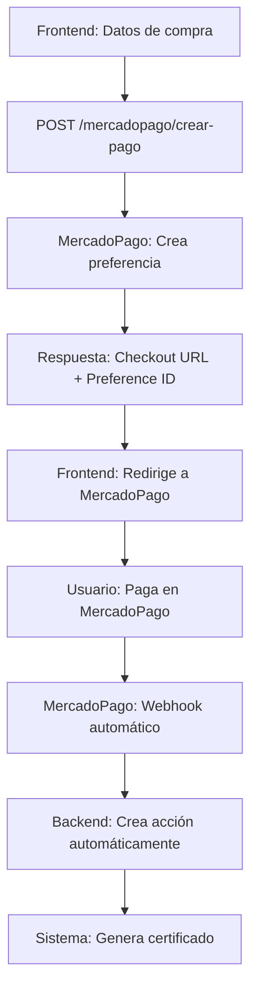

# 🚀 MERCADOPAGO - EL MÁS FÁCIL DE CONFIGURAR

## ✅ **¿POR QUÉ MERCADOPAGO?**

- ✅ **API de prueba inmediata** (no necesitas verificar cuenta)
- ✅ **Documentación en español**
- ✅ **Funciona perfecto en Bolivia**
- ✅ **QR nativo** para apps bancarias
- ✅ **Webhooks automáticos**
- ✅ **Gratuito** hasta 500 transacciones/mes
- ✅ **Configuración en 2 minutos**

## 🔧 **CONFIGURACIÓN EN 2 MINUTOS**

### **1. Crear Cuenta (30 segundos)**
1. Ve a https://www.mercadopago.com.bo
2. Crea cuenta con tu email
3. **NO necesitas verificar** para pruebas

### **2. Obtener Credenciales (30 segundos)**
1. Ve a **Desarrolladores > Tus credenciales**
2. Copia:
   - **Access Token** (APP_USR-...)
   - **Public Key** (APP_USR-...)

### **3. Actualizar config.py (30 segundos)**
```python
# config.py
MERCADOPAGO_ACCESS_TOKEN = "APP_USR-TU_TOKEN_REAL_AQUI"
MERCADOPAGO_PUBLIC_KEY = "APP_USR-TU_PUBLIC_KEY_REAL_AQUI"
```

### **4. ¡Listo! (30 segundos)**
Ya tienes MercadoPago funcionando

## 📱 **ENDPOINTS DISPONIBLES**

### **Crear Pago:**
```http
POST /acciones/mercadopago/crear-pago
```

**Datos:**
```json
{
  "id_socio": 123,
  "cantidad_acciones": 100,
  "precio_unitario": 50.00,
  "total_pago": 5000.00,
  "metodo_pago": "mercadopago",
  "modalidad_pago": 1,
  "tipo_accion": "compra"
}
```

**Respuesta:**
```json
{
  "preference_id": "1234567890-abc-def",
  "init_point": "https://www.mercadopago.com.bo/checkout/v1/redirect?pref_id=...",
  "sandbox_init_point": "https://sandbox.mercadopago.com.bo/checkout/v1/redirect?pref_id=...",
  "status": "created",
  "amount": 5000.00,
  "currency": "BOB",
  "external_reference": "TEMP_ABC123",
  "qr_code": "https://www.mercadopago.com.bo/checkout/v1/redirect?pref_id=...",
  "checkout_url": "https://www.mercadopago.com.bo/checkout/v1/redirect?pref_id=..."
}
```

### **Verificar Pago:**
```http
GET /acciones/mercadopago/verificar-pago/{preference_id}
```

### **Buscar Pagos:**
```http
GET /acciones/mercadopago/buscar-pagos/{external_reference}
```

### **Confirmar Pago:**
```http
POST /acciones/mercadopago/confirmar-pago/{external_reference}
```

### **Configuración:**
```http
GET /acciones/mercadopago/configuracion
```

### **Webhook:**
```http
POST /acciones/mercadopago/webhook
```

## 💻 **INTEGRACIÓN EN EL FRONTEND**

```javascript
// Crear pago con MercadoPago
const crearPagoMercadoPago = async (datosPago) => {
  const response = await fetch('/acciones/mercadopago/crear-pago', {
    method: 'POST',
    headers: {
      'Authorization': `Bearer ${token}`,
      'Content-Type': 'application/json'
    },
    body: JSON.stringify({
      id_socio: 123,
      cantidad_acciones: 100,
      precio_unitario: 50.00,
      total_pago: 5000.00,
      metodo_pago: "mercadopago",
      modalidad_pago: 1,
      tipo_accion: "compra"
    })
  });
  
  const data = await response.json();
  return data;
};

// Mostrar checkout de MercadoPago
const mostrarCheckout = (pagoData) => {
  // Opción 1: Redirigir a MercadoPago
  window.location.href = pagoData.checkout_url;
  
  // Opción 2: Mostrar en iframe
  const iframe = document.createElement('iframe');
  iframe.src = pagoData.sandbox_init_point; // Para pruebas
  iframe.width = '100%';
  iframe.height = '600px';
  document.body.appendChild(iframe);
};

// Verificar estado del pago
const verificarPago = async (preferenceId) => {
  const response = await fetch(`/acciones/mercadopago/verificar-pago/${preferenceId}`, {
    headers: {
      'Authorization': `Bearer ${token}`
    }
  });
  
  const data = await response.json();
  return data;
};
```

## 🎯 **FLUJO COMPLETO**



## 🔗 **WEBHOOKS AUTOMÁTICOS**

MercadoPago envía webhooks automáticamente cuando:
- Se crea un pago
- Se aprueba un pago
- Se rechaza un pago

**Configuración del webhook:**
1. Ve a **Desarrolladores > Webhooks**
2. Crea endpoint: `https://tu-dominio.com/acciones/mercadopago/webhook`
3. Selecciona eventos:
   - `payment.created`
   - `payment.updated`

## 🧪 **PRUEBA RÁPIDA**

```bash
# 1. Crear pago
curl -X POST "http://localhost:8000/acciones/mercadopago/crear-pago" \
  -H "Authorization: Bearer TU_TOKEN" \
  -H "Content-Type: application/json" \
  -d '{
    "id_socio": 1,
    "cantidad_acciones": 100,
    "precio_unitario": 50.00,
    "total_pago": 5000.00,
    "metodo_pago": "mercadopago",
    "modalidad_pago": 1,
    "tipo_accion": "compra"
  }'

# 2. Verificar pago
curl -X GET "http://localhost:8000/acciones/mercadopago/verificar-pago/PREFERENCE_ID" \
  -H "Authorization: Bearer TU_TOKEN"
```

## 🎉 **VENTAJAS**

1. **✅ Configuración súper fácil** - 2 minutos
2. **✅ API de prueba inmediata** - No necesitas verificar cuenta
3. **✅ Documentación en español** - Fácil de entender
4. **✅ Funciona perfecto en Bolivia** - Soporte local
5. **✅ QR nativo** - Para apps bancarias
6. **✅ Webhooks automáticos** - Sin configuración manual
7. **✅ Gratuito** - Hasta 500 transacciones/mes
8. **✅ Checkout profesional** - MercadoPago maneja todo

## 🚀 **PRÓXIMOS PASOS**

1. **Crear cuenta en MercadoPago** (2 minutos)
2. **Obtener credenciales** (1 minuto)
3. **Actualizar config.py** (1 minuto)
4. **¡Probar!** (0 minutos)

---

**¡MercadoPago es la opción MÁS FÁCIL para empezar! 🎯**
