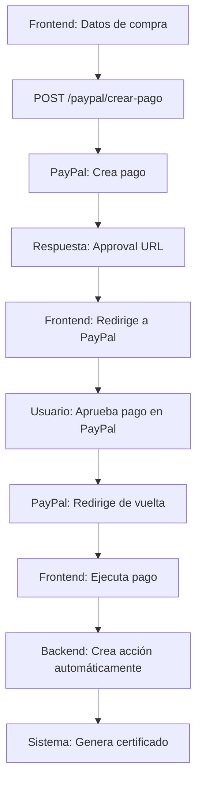

# 🚀 PAYPAL - EL MÁS FÁCIL DE CONFIGURAR

## ✅ **¿POR QUÉ PAYPAL?**

- ✅ **API de prueba inmediata** (Sandbox)
- ✅ **No necesitas verificar cuenta** para pruebas
- ✅ **Funciona en Bolivia**
- ✅ **Documentación clara**
- ✅ **Gratuito** para pruebas
- ✅ **Configuración en 1 minuto**

## 🔧 **CONFIGURACIÓN EN 1 MINUTO**

### **1. Crear Cuenta (30 segundos)**
1. Ve a https://developer.paypal.com
2. Crea cuenta de desarrollador
3. **NO necesitas verificar** para pruebas

### **2. Obtener Credenciales (30 segundos)**
1. Ve a **My Apps & Credentials**
2. Crea una nueva app
3. Copia **Client ID** y **Client Secret**

### **3. Actualizar config.py (30 segundos)**
```python
# config.py
PAYPAL_CLIENT_ID = "TU_CLIENT_ID_REAL_AQUI"
PAYPAL_CLIENT_SECRET = "TU_CLIENT_SECRET_REAL_AQUI"
PAYPAL_MODE = "sandbox"  # Para pruebas
```

### **4. ¡Listo! (30 segundos)**
Ya tienes PayPal funcionando

## 📱 **ENDPOINTS DISPONIBLES**

### **Crear Pago:**
```http
POST /acciones/paypal/crear-pago
```

**Datos:**
```json
{
  "id_socio": 123,
  "cantidad_acciones": 100,
  "precio_unitario": 50.00,
  "total_pago": 5000.00,
  "metodo_pago": "paypal",
  "modalidad_pago": 1,
  "tipo_accion": "compra"
}
```

**Respuesta:**
```json
{
  "payment_id": "PAY-1234567890ABCDEF",
  "state": "created",
  "intent": "sale",
  "amount": {
    "total": "5000.00",
    "currency": "USD"
  },
  "approval_url": "https://www.sandbox.paypal.com/cgi-bin/webscr?cmd=_express-checkout&token=...",
  "external_reference": "TEMP_ABC123",
  "metadata": {
    "socio_id": "123",
    "cantidad_acciones": "100",
    "precio_unitario": "50.00",
    "tipo_accion": "compra",
    "referencia_temporal": "TEMP_ABC123"
  }
}
```

### **Ejecutar Pago:**
```http
POST /acciones/paypal/ejecutar-pago
```

**Datos:**
```json
{
  "payment_id": "PAY-1234567890ABCDEF",
  "payer_id": "USER123456789"
}
```

### **Obtener Pago:**
```http
GET /acciones/paypal/obtener-pago/{payment_id}
```

### **Configuración:**
```http
GET /acciones/paypal/configuracion
```

## 💻 **INTEGRACIÓN EN EL FRONTEND**

```javascript
// Crear pago con PayPal
const crearPagoPayPal = async (datosPago) => {
  const response = await fetch('/acciones/paypal/crear-pago', {
    method: 'POST',
    headers: {
      'Authorization': `Bearer ${token}`,
      'Content-Type': 'application/json'
    },
    body: JSON.stringify({
      id_socio: 123,
      cantidad_acciones: 100,
      precio_unitario: 50.00,
      total_pago: 5000.00,
      metodo_pago: "paypal",
      modalidad_pago: 1,
      tipo_accion: "compra"
    })
  });
  
  const data = await response.json();
  return data;
};

// Redirigir a PayPal para aprobación
const aprobarPagoPayPal = (approvalUrl) => {
  window.location.href = approvalUrl;
};

// Ejecutar pago después de aprobación
const ejecutarPagoPayPal = async (paymentId, payerId) => {
  const response = await fetch('/acciones/paypal/ejecutar-pago', {
    method: 'POST',
    headers: {
      'Authorization': `Bearer ${token}`,
      'Content-Type': 'application/json'
    },
    body: JSON.stringify({
      payment_id: paymentId,
      payer_id: payerId
    })
  });
  
  const data = await response.json();
  return data;
};

// Componente completo de pago
const PagoAccionesPayPal = () => {
  const [pagoData, setPagoData] = useState(null);
  
  const iniciarPago = async () => {
    try {
      const pago = await crearPagoPayPal({
        id_socio: socioId,
        cantidad_acciones: cantidad,
        precio_unitario: precio,
        total_pago: total
      });
      
      setPagoData(pago);
      
      // Redirigir a PayPal para aprobación
      aprobarPagoPayPal(pago.approval_url);
      
    } catch (error) {
      console.error('Error creando pago:', error);
    }
  };
  
  return (
    <div>
      <button onClick={iniciarPago}>
        Pagar con PayPal
      </button>
    </div>
  );
};
```

## 🎯 **FLUJO COMPLETO**



## 🧪 **PRUEBA RÁPIDA**

```bash
# 1. Crear pago
curl -X POST "http://localhost:8000/acciones/paypal/crear-pago" \
  -H "Authorization: Bearer TU_TOKEN" \
  -H "Content-Type: application/json" \
  -d '{
    "id_socio": 1,
    "cantidad_acciones": 100,
    "precio_unitario": 50.00,
    "total_pago": 5000.00,
    "metodo_pago": "paypal",
    "modalidad_pago": 1,
    "tipo_accion": "compra"
  }'

# 2. Obtener pago
curl -X GET "http://localhost:8000/acciones/paypal/obtener-pago/PAYMENT_ID" \
  -H "Authorization: Bearer TU_TOKEN"
```

## 🎉 **VENTAJAS**

1. **✅ Configuración súper fácil** - 1 minuto
2. **✅ API de prueba inmediata** - Sandbox
3. **✅ No necesitas verificar cuenta** - Para pruebas
4. **✅ Funciona en Bolivia** - Soporte global
5. **✅ Documentación clara** - Fácil de entender
6. **✅ Gratuito** - Para pruebas
7. **✅ Checkout profesional** - PayPal maneja todo
8. **✅ Seguridad** - PayPal maneja la seguridad

## 🚀 **PRÓXIMOS PASOS**

1. **Crear cuenta en PayPal Developer** (1 minuto)
2. **Obtener credenciales** (1 minuto)
3. **Actualizar config.py** (1 minuto)
4. **¡Probar!** (0 minutos)

## 🔗 **URLS IMPORTANTES**

- **Developer Portal:** https://developer.paypal.com
- **Sandbox:** https://www.sandbox.paypal.com
- **Documentación:** https://developer.paypal.com/docs/api/overview/

---

**¡PayPal es la opción MÁS FÁCIL para empezar! 🎯**
